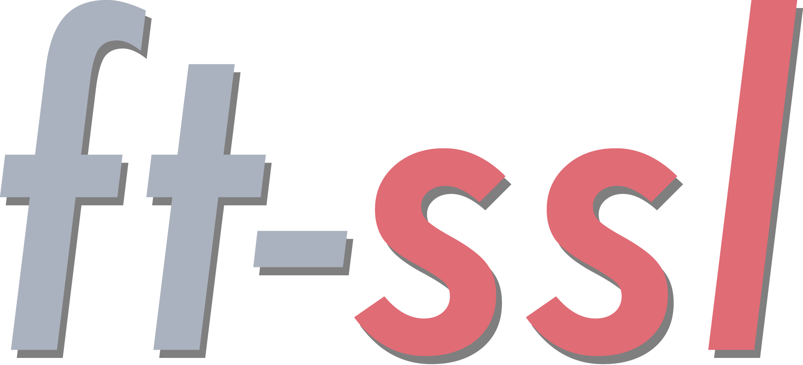

<h1 align="center">
 

 
</h1>

<h3 align="center">A series of projects of 42, where we have to re-code some part of OpenSSL.</h3>

---

## Description

`Ft-ssl` is composed of 3 different projects:
 - `ft-ssl-md5`
 - `ft-ssl-des`
 - `ft-ssl-rsa`

For now only [ft-ssl-md5](https://github.com/lpieri/ft_ssl/tree/ft_ssl_md5) is finished.

Ft-ssl-des is in progress, you can find it [here](https://github.com/lpieri/ft_ssl/tree/dev/functions/evp_functions). For now, I'm redoing the parsing to adapt it with `PBKDF2` and `EVP-BytesToKey`.

## Ft-ssl-md5

For `md5`, we had to re-encode hash algorithms. Two algorithms are mandatory `md5` and `sha256`.

